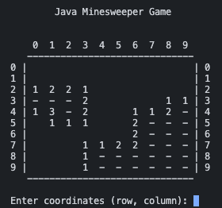

# Java Minesweeper Game README

## Project Overview
Minesweeper DUE MONDAY 6th MAY: A console-based recreation of the classic Minesweeper game. Developed in Java, this project implements basic gameplay features, allowing users to explore a mine-laden grid via the console.

## Screenshot

## Table of Contents
- [Tech Stack](#tech-stack)
- [Goals](#goals)
- [How to Use](#how-to-use)
- [Implementation](#implementation)
- [Code / Important Elements / Design Decisions](#code--important-elements--design-decisions)
- [Issues & Bugs](#issues--bugs)
- [Additions & Improvements](#additions--improvements)
- [Learning Highlights](#learning-highlights)

## Tech Stack
- Java
- CLI
- Git

## Goals
The primary goal is to build a functional Minesweeper game that runs in the Java console, focusing on core gameplay mechanics and simple user interactions.

## How to Use
1. Run the application from your Java console.
2. Enter coordinates to reveal squares.
3. Avoid mines and clear the board to win!

## Implementation
- **MVP (basic requirements):** Generates a 10x10 grid with 10 randomly placed mines, capturing user input through the Java console.
- **User Interface:** Utilizes System.out and Scanner to interact with the user, displaying the grid and results of actions.
- **Logic Strategy:** Employs arrays to handle game logic, updating the state based on user input and calculating adjacent mines.

## Code / Important Elements / Design Decisions
Focused on object-oriented programming principles to structure the game efficiently, with separate classes for the game board and cells to enhance maintainability and scalability.

## Issues & Bugs
No major issues are currently known. Future testing may be needed to refine edge cases and improve error handling.

## Future Additions & Improvements
- Implement user-configurable settings for mines and grid size.
- Track wins and losses via a file.
- Expand to a web application for broader accessibility.

## Learning Highlights
Gained practical experience in managing game state and user interactions within a console-based application, reinforcing Java programming skills and object-oriented design.

## Contact Me:
- Visit my [LinkedIn](https://www.linkedin.com/in/obj809/) for more details.
- Visit my [GitHub](https://github.com/cyberforge1) for more projects.
- Or send me an email at obj809@gmail.com